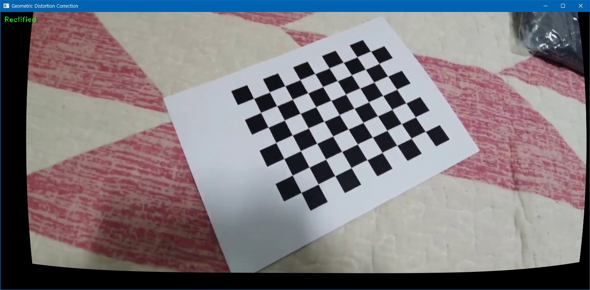

# Undistort

Simple camera calibration + undisort video. Video for testing included.

Chessboard for calibration created using [Typst](https://typst.app), LaTeX alternative. Check `data/chessboard.typ` for detailed information.

## Camera Calibration Results
* The number of selected images = 40
* RMS error = 0.9049330765827764
* Camera matrix (K) =
[[696.83969162   0.         730.33604349]
 [  0.         701.95439818 401.66420193]
 [  0.           0.           1.        ]]
* Distortion coefficient (k1, k2, p1, p2, k3, ...) = [-0.03263006  0.04702803  0.00563099 -0.00420171  0.02470244]